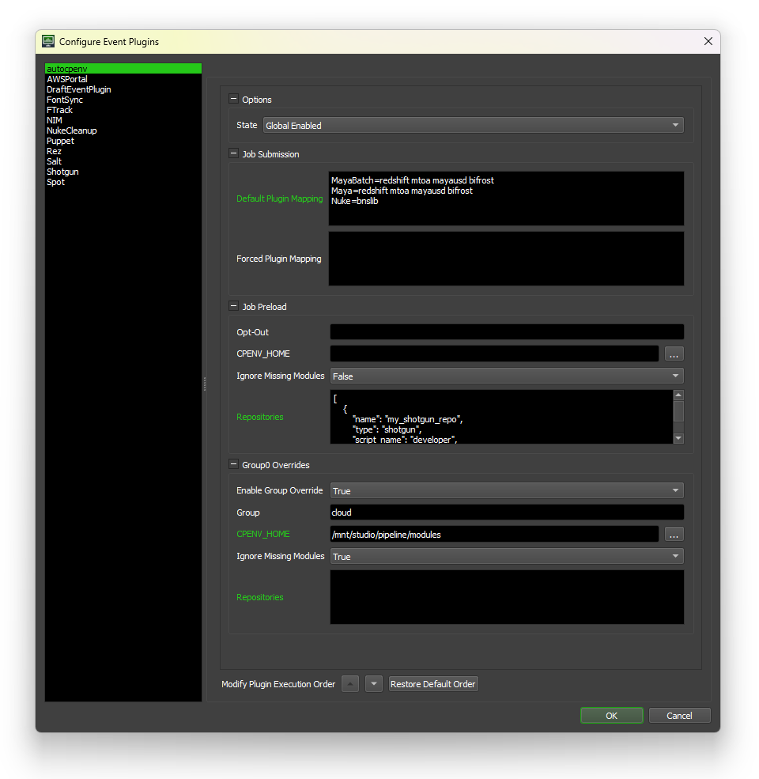

# autocpenv

Deadline Event Plugin that automatically activates cpenv requirements when a worker starts rendering a task. When submitting a job, this event plugin will check the user's CPENV_ACTIVE_MODULES Environment variable for modules. If CPENV_ACTIVE_MODULES is undefined, the event will fallback to the requirements specified in the Default Plugin Mapping setting.

**Warning:** This version (v0.6.0+) introduces a new set of options that require reconfiguration. If you need to use the previous version checkout tag v0.5.6.

## Installation
1. Clone this git repository into your Deadline repository's custom events location.

   ```
       cd DEADLINE_REPOSITORY_PATH/custom/events
       git clone https://github.com/cpenv/autocpenv.git
   ```

2. Copy GlobalJobPreLoad.py to DEADLINE_REPOSITORY_PATH/custom/plugins or add the contents of GlobalJobPreLoad.py to your own if you're already using one.

3. Use git pull to upgrade autocpenv.

   ```
       cd DEADLINE_REPOSITORY_PATH/custom/events/autocpenv
       git pull origin master
   ```

## Configuration

Open Deadline Monitor and enable *super user* mode in the tools menu. Then open the *Configure Event Plugins* dialog also in tools menu.



### Options

* State: How this event plug-in should respond to events. If Global, all jobs and workers will trigger the events for this plugin. If Opt-In, jobs and workers can choose to trigger the events for this plugin. If Disabled, no events are triggered for this plugin.

### Job Submission

* Default Plugin Mapping: Mapping of deadline plugins to cpenv requirements. Each line should start with a deadline plugin and end with a space separate list of cpenv requirements.

  * Each line configures a Deadline Plugin
  * **{Deadline_Plugin}={cpenv_module}**

* Forced Plugin Mapping: These cpenv requirements are always added to a job's environment. This allows you to ensure that certain requirements are always available for specific deadline plugins. The formatting is the same as Plugin Mapping.

### Job Preload

* Opt-Out: Space separated list of wildcard patterns, like aws-*, group names, or worker names to exclude from running the autocpenv GlobalJobPreload script. The GlobalJobPreload script is responsible for activating cpenv modules on a worker prior to rendering a Job's tasks.
* CPENV_HOME: Path to cpenv home. Defaults to a local directory. Can be set to a shared network location. Place a config.yml file within the home directory to configure repositories. See the cpenv documentation for more info.
* Ignore Missing Modules: This setting allows the JobPreload script to continue running even if all the modules can not be resoled. Any unresolved modules will just be skipped, and the rest will be activated.
* Repositories: Json list of dicts containing cpenv repositories to configure.

### Repositories Example

```
[
    {
        "name": "my_shotgun_repo",
        "type": "shotgun",
        "script_name": "<SCRIPT_NAME>",
        "api_key": "<API_KEY>",
        "base_url": "https://<STUDIO>.shotgunstudio.com",
        "module_entity": "CustomNonProjectEntity01"
    },
    {
        "name": "network_repo",
        "type": "local",
        "path": "/mnt/studio/pipeline/modules"
    }
]
```

### Group Overrides

The group override sections allow you to override settings for a particular group. For example if you have a group of cloud workers, you may need to configure them separately with a different list of repositories and a different home directory.

If you need more than one set of overrides, open the autocpenv.param file and duplicate all of the Group0 settings and rename them to Group1 and increment the category order.

### Documentation

Visit the [cpenv repo](https://github.com/cpenv/cpenv) for additional help.
